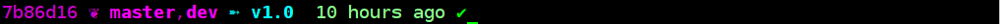
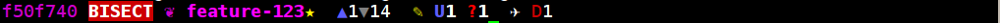

# Colorful git prompt for bash with symbols

Source `git-prompt.sh` into your bash session.
Prepend the following string to your PS1: `$(__git_prompt_print)`

# Examples

You are standing on the master branch, which was committed 13 hours ago 
and there were no changes so far.

Same as above, but there is 1 file ignored by git. 
You can disable showing ignored files by setting `GIT_PROMPT_SHOW_IGNORED=` bash variable (empty string), 
enable by `GIT_PROMPT_SHOW_IGNORED=1`.

A star next to the branch name indicates the branch is not in synchron with its upstream. 
Either push or poll is needed or even the remote branch is not exists.

You are on an unsynchronized branch, which is ahead by 1 and behind by 5 commits from the master.

You are on an unsynchronized branch, which is ahead by 1 and behind by 14 commits from the master.
You have 1 untracked file (or directory) in the working tree.

You are on the master branch, but dev branch is also stays here.
The current commit has a tag.

You are on dev branch which is not pushed to the upstream.

There are changes in stage (plan icon), 1 file being added, 1 deleted, 1 edited, and 1 renamed in the next commit. 
You can see how many lines are added and removed.
Only lines in text files are counted, not binary blocks.
You can disable the costly line counting operation by setting bash variable `GIT_PROMPT_COUNT_LINES=` (empty string), default is enabled.

The working tree is edited (pencil icon).
You can see the same status letters as in stage.

Full circle indicates stashed files.

You have unstaged, staged, and stashed changes.

You have 2 stash entries in a clean working tree.

You are in a detached HEAD state.
Current commint is behind the master branch by 3 commits.

Detached HEAD state.
Current commit is expressed by the relation to the next tag.
This is the default behavior if there is a tag, otherwise branch names are used.

You are in BISECT mode.
There is 1 merge conflict denoted by `U1`.

Current working directory is under `.git`.
You are also in MERGE mode.

